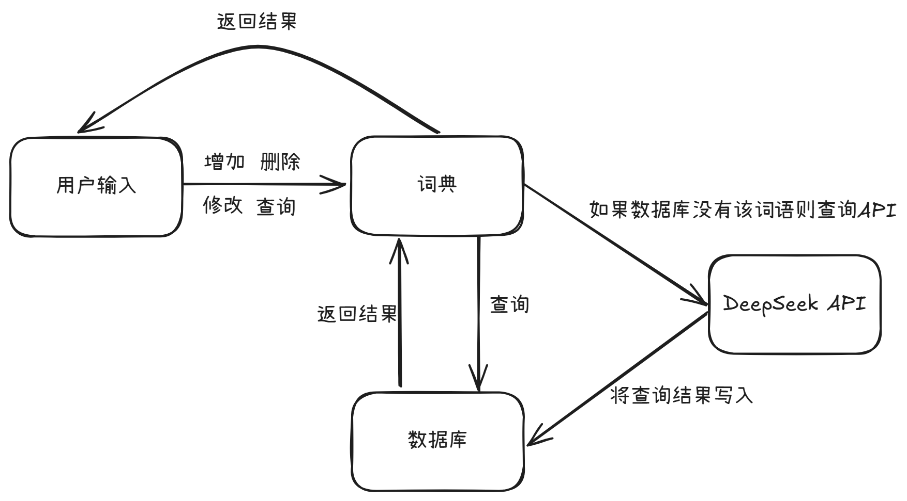

# 考公词语字典（kgdict）


## 安装

下载代码：

```
git clone https://github.com/acouq/kgdict.git
```

切换到项目目录：

```
cd kgdict
```

使用 uv 进行安装：

```
uv tool install .
```

确保设置了环境变量 `DEEPSEEK_API_KEY`（或 `OPENAI_API_KEY`）。

## 使用

```
kgdict -h

usage: kgdict [-h] [--version] {add,del,set,get,pick,range} ...

考公词语字典 v0.1.0

positional arguments:
  {add,del,set,get,pick,range}
    add                 增加: 词语...
    del                 删除: 词语...
    set                 修改: 词语 词义
    get                 查询: 词语...
    pick                查询: 随机抽取 N 个词语
    range               阅读: N1 N2, 查询第 N1 个到第 N2 个之间的词语

options:
  -h, --help            show this help message and exit
  --version             show program's version number and exit
```

数据库默认位于 Windows 的 `%APPDATA%/kgdict/kgdict.db`，其他系统位于 `~/.kgdict/kgdict.db`。

## 代码结构

